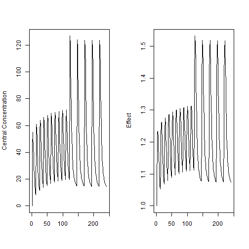
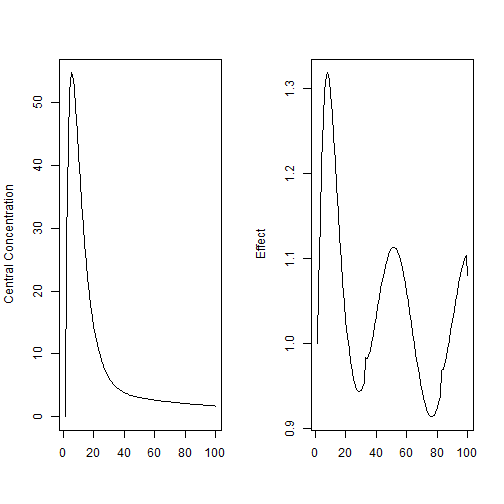
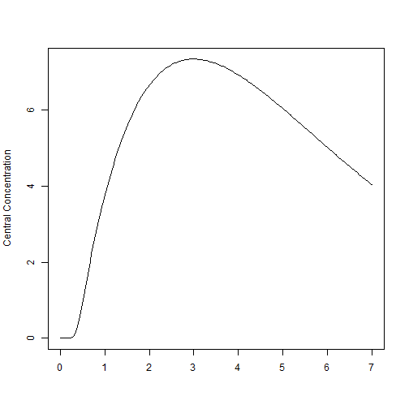
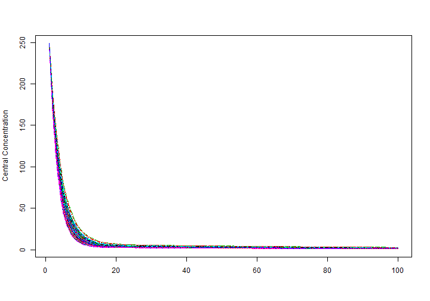
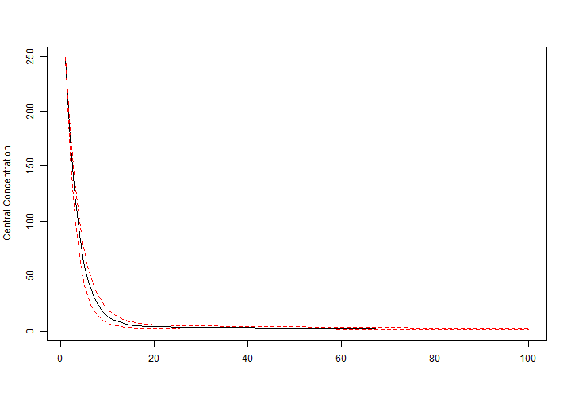
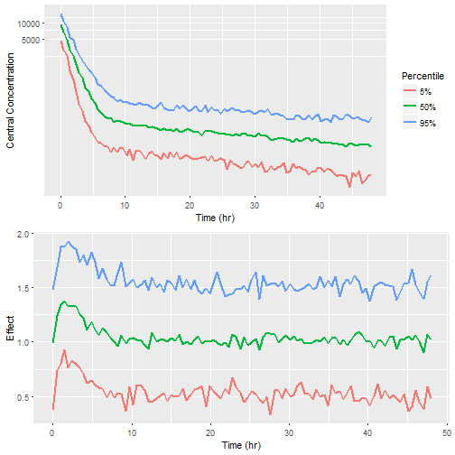
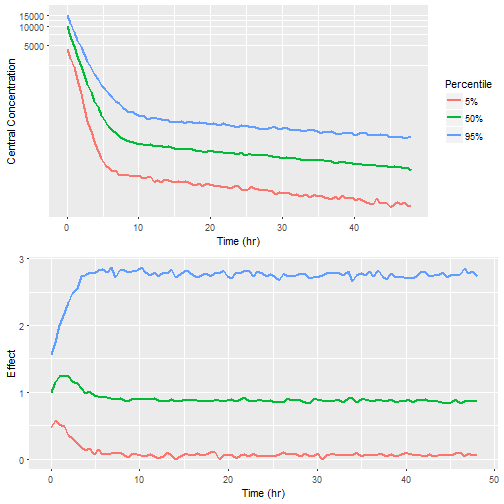

[](https://travis-ci.org/nlmixrdevelopment/RxODE)
[](https://ci.appveyor.com/project/mattfidler/rxode)
[](https://codecov.io/github/nlmixrdevelopment/RxODE?branch=master)
[](https://cran.r-project.org/package=RxODE)
[](https://cran.r-project.org/package=RxODE)
[](https://dependencyci.com/github/nlmixrdevelopment/RxODE)


## RxODE: A tool for performing simulations from Ordinary Differential Equation (ODE) models, with applications for pharmacometrics
***  

##### Authors: Matthew L. Fidler, Melissa Hallow, and Wenping Wang

***

function (pkg = ".", reload = TRUE, quick = FALSE, local = TRUE, args = getOption("devtools.install.args"), quiet = FALSE, dependencies = NA, upgrade_dependencies = TRUE, build_vignettes = FALSE, keep_source = getOption("keep.source.pkgs"), threads = getOption("Ncpus", 1), force_deps = FALSE, metadata = remote_metadata(as.package(pkg)), out_dir = NULL, skip_if_log_exists = FALSE, ...) 
{
    pkg <- as.package(pkg)
    check_build_tools(pkg)
    if (is_loaded(pkg)) {
        eapply(ns_env(pkg), force, all.names = TRUE)
    }
    root_install <- is.null(installing$packages)
    if (root_install) {
        on.exit(installing$packages <- NULL, add = TRUE)
    }
    if (pkg$package %in% installing$packages) {
        if (!quiet) {
            message("Skipping ", pkg$package, ", it is already being installed.")
        }
        return(invisible(FALSE))
    }
    if (!is.null(out_dir)) {
        out_file <- file.path(out_dir, paste0(pkg$package, ".out"))
        if (skip_if_log_exists && file.exists(out_file)) {
            message("Skipping ", pkg$package, ", installation failed before, see log in ", out_file)
            return(invisible(FALSE))
        }
    }
    else {
        out_file <- NULL
    }
    installing$packages <- c(installing$packages, pkg$package)
    if (!quiet) {
        message("Installing ", pkg$package)
    }
    if (build_vignettes && missing(dependencies)) {
        dependencies <- standardise_dep(TRUE)
    }
    else {
        dependencies <- standardise_dep(dependencies)
    }
    initial_deps <- dependencies[dependencies != "Suggests"]
    final_deps <- dependencies[dependencies == "Suggests"]
    installing$remote_deps <- remote_deps(pkg)
    on.exit(installing$remote_deps <- NULL, add = TRUE)
    install_deps(pkg, dependencies = initial_deps, upgrade = upgrade_dependencies, threads = threads, force_deps = force_deps, quiet = quiet, ..., out_dir = out_dir, skip_if_log_exists = skip_if_log_exists)
    has_vignettes <- length(tools::pkgVignettes(dir = pkg$path)$docs > 0)
    if (local && !(has_vignettes && build_vignettes)) {
        built_path <- pkg$path
    }
    else {
        built_path <- build(pkg, tempdir(), vignettes = build_vignettes, quiet = quiet)
        on.exit(unlink(built_path), add = TRUE)
    }
    opts <- c(paste("--library=", shQuote(.libPaths()[1]), sep = ""), if (keep_source) "--with-keep.source", "--install-tests")
    if (quick) {
        opts <- c(opts, "--no-docs", "--no-multiarch", "--no-demo")
    }
    opts <- paste(paste(opts, collapse = " "), paste(args, collapse = " "))
    built_path <- normalizePath(built_path, winslash = "/")
    R(paste("CMD INSTALL ", shQuote(built_path), " ", opts, sep = ""), fun = system2_check, quiet = quiet || !is.null(out_file), out_file = out_file)
    unlink(out_file)
    install_deps(pkg, dependencies = final_deps, upgrade = upgrade_dependencies, threads = threads, force_deps = force_deps, quiet = quiet, ..., out_dir = out_dir, skip_if_log_exists = skip_if_log_exists)
    if (length(metadata) > 0) {
        add_metadata(inst(pkg$package), metadata)
    }
    if (reload) {
        reload(pkg, quiet = quiet)
    }
    invisible(TRUE)
}
#### Introduction
`RxODE` is an R package that facilitates simulation with ODE models in
R. It is designed with pharmacometrics models in mind, but can be
applied more generally to any ODE model.

***
#### Description of RxODE illustrated through an example
The model equations are specified through a text string in R. Both
differential and algebraic equations are permitted. Differential
equations are specified by `d/dt(var_name) = `. Each
equation can be separated by a semicolon.

```r
ode <- "
   C2 = centr/V2;
   C3 = peri/V3;
   d/dt(depot) =-KA*depot;
   d/dt(centr) = KA*depot - CL*C2 - Q*C2 + Q*C3;
   d/dt(peri)  =                    Q*C2 - Q*C3;
   d/dt(eff)  = Kin - Kout*(1-C2/(EC50+C2))*eff;
"
```
To load `RxODE` package and compile the model: 

```r
library(RxODE)
work <- tempfile("Rx_intro-")
mod1 <- RxODE(model = ode, modName = "mod1", wd = work)
```
##### Specify ODE parameters and initial conditions

Model parameters can be defined as named vectors. Names of parameters in
the vector must be a superset of parameters in the ODE model, and the
order of parameters within the vector is not important. 

```r
theta <- 
   c(KA=2.94E-01, CL=1.86E+01, V2=4.02E+01, # central 
     Q=1.05E+01,  V3=2.97E+02,              # peripheral
     Kin=1, Kout=1, EC50=200)               # effects
```

Initial conditions (ICs) are defined through a vector as well. If the
vector is not named, the number of ICs must equal exactly the number of
ODEs in the model, and the order must be the same as the order in
which the ODEs are listed in the model. 

```r
inits <- c(0, 0, 0, 1)
```

When elements are named, missing elements are added and set to
zero. Also when named, the order of initilizations does not matter.
Therefore the following code is an equvalent initialization as the
code above.

```r
inits <- c(eff=1);
```

##### Specify Dosing and sampling in RxODE

`RxODE` provides a simple and very flexible way to specify dosing and
sampling through functions that generate an event table. First, an
empty event table is generated through the "eventTable()" function:

```r
ev <- eventTable(amount.units='mg', time.units='hours')
```

Next, use the `add.dosing()` and `add.sampling()` functions of the
`EventTable` object to specify the dosing (amounts, frequency and/or
times, etc.) and observation times at which to sample the state of the
system.  These functions can be called multiple times to specify more
complex dosing or sampling regiments.  Here, these functions are used
to specify 10mg BID dosing for 5 days, followed by 20mg QD dosing for
5 days:

```r
ev$add.dosing(dose=10000, nbr.doses=10, dosing.interval=12)
ev$add.dosing(dose=20000, nbr.doses=5, start.time=120, dosing.interval=24)
ev$add.sampling(0:240)
```

If you wish you can also do this with the `mattigr` pipe operator `%>%`

```r
ev <- eventTable(amount.units="mg", time.units="hours") %>%
    add.dosing(dose=10000, nbr.doses=10, dosing.interval=12) %>%
    add.dosing(dose=20000, nbr.doses=5, start.time=120,dosing.interval=24) %>%
    add.sampling(0:240);
```

The functions `get.dosing()` and `get.sampling()` can be used to
retrieve information from the event table.

```r
head(ev$get.dosing())
```

```
##   time evid   amt
## 1    0  101 10000
## 2   12  101 10000
## 3   24  101 10000
## 4   36  101 10000
## 5   48  101 10000
## 6   60  101 10000
```

```r
head(ev$get.sampling())
```

```
##    time evid amt
## 16    0    0  NA
## 17    1    0  NA
## 18    2    0  NA
## 19    3    0  NA
## 20    4    0  NA
## 21    5    0  NA
```

##### Solving ODEs

The ODE can now be solved by calling the model object's `run` or `solve`
function. Simulation results for all variables in the model are stored
in the output matrix x. 

```r
x <- mod1$solve(theta, ev, inits)
head(x)
```

```
##      time     depot    centr      peri      eff       C2        C3
## [1,]    0 10000.000    0.000    0.0000 1.000000  0.00000 0.0000000
## [2,]    1  7452.765 1783.897  273.1895 1.084664 44.37555 0.9198298
## [3,]    2  5554.370 2206.295  793.8758 1.180825 54.88296 2.6729825
## [4,]    3  4139.542 2086.518 1323.5783 1.228914 51.90343 4.4564927
## [5,]    4  3085.103 1788.795 1776.2702 1.234610 44.49738 5.9807076
## [6,]    5  2299.255 1466.670 2131.7169 1.214742 36.48434 7.1774981
```

This returns a matrix.  You can see the compartment values in the plot
below:

```r
par(mfrow=c(1,2))
matplot(x[,"C2"], type="l", ylab="Central Concentration")
matplot(x[,"eff"], type="l", ylab = "Effect")
```



##### Using RxODE data frames

You can also return a solved object that is a modified data-frame.
This is done by the `predict()` or `solve()` methods:

```r
x <- predict(mod1,theta, ev, inits)
print(x)
```

```
## ___________________________ Solved RxODE object ___________________________
```

```
## -- Parameters ($params): --------------------------------------------------
```

```
##      V2      V3      KA      CL       Q     Kin    Kout    EC50 
##  40.200 297.000   0.294  18.600  10.500   1.000   1.000 200.000
```

```
## -- Initial Conditions ($inits): -------------------------------------------
```

```
## depot centr  peri   eff 
##     0     0     0     1
```

```
## -- First part of data (object): -------------------------------------------
```

```
## # A tibble: 241 x 7
##    time depot centr  peri   eff    C2    C3
##   <dbl> <dbl> <dbl> <dbl> <dbl> <dbl> <dbl>
## 1  0    10000     0     0  1.00   0   0    
## 2  1.00  7453  1784   273  1.08  44.4 0.920
## 3  2.00  5554  2206   794  1.18  54.9 2.67 
## 4  3.00  4140  2087  1324  1.23  51.9 4.46 
## 5  4.00  3085  1789  1776  1.23  44.5 5.98 
## 6  5.00  2299  1467  2132  1.21  36.5 7.18 
## # ... with 235 more rows
```

```
## ___________________________________________________________________________
```
or

```r
x <- solve(mod1,theta, ev, inits)
print(x)
```

```
## ___________________________ Solved RxODE object ___________________________
```

```
## -- Parameters ($params): --------------------------------------------------
```

```
##      V2      V3      KA      CL       Q     Kin    Kout    EC50 
##  40.200 297.000   0.294  18.600  10.500   1.000   1.000 200.000
```

```
## -- Initial Conditions ($inits): -------------------------------------------
```

```
## depot centr  peri   eff 
##     0     0     0     1
```

```
## -- First part of data (object): -------------------------------------------
```

```
## # A tibble: 241 x 7
##    time depot centr  peri   eff    C2    C3
##   <dbl> <dbl> <dbl> <dbl> <dbl> <dbl> <dbl>
## 1  0    10000     0     0  1.00   0   0    
## 2  1.00  7453  1784   273  1.08  44.4 0.920
## 3  2.00  5554  2206   794  1.18  54.9 2.67 
## 4  3.00  4140  2087  1324  1.23  51.9 4.46 
## 5  4.00  3085  1789  1776  1.23  44.5 5.98 
## 6  5.00  2299  1467  2132  1.21  36.5 7.18 
## # ... with 235 more rows
```

```
## ___________________________________________________________________________
```

Or with `mattigr`

```r
x <- mod1 %>% solve(theta, ev, inits)
print(x)
```

```
## ___________________________ Solved RxODE object ___________________________
```

```
## -- Parameters ($params): --------------------------------------------------
```

```
##      V2      V3      KA      CL       Q     Kin    Kout    EC50 
##  40.200 297.000   0.294  18.600  10.500   1.000   1.000 200.000
```

```
## -- Initial Conditions ($inits): -------------------------------------------
```

```
## depot centr  peri   eff 
##     0     0     0     1
```

```
## -- First part of data (object): -------------------------------------------
```

```
## # A tibble: 241 x 7
##    time depot centr  peri   eff    C2    C3
##   <dbl> <dbl> <dbl> <dbl> <dbl> <dbl> <dbl>
## 1  0    10000     0     0  1.00   0   0    
## 2  1.00  7453  1784   273  1.08  44.4 0.920
## 3  2.00  5554  2206   794  1.18  54.9 2.67 
## 4  3.00  4140  2087  1324  1.23  51.9 4.46 
## 5  4.00  3085  1789  1776  1.23  44.5 5.98 
## 6  5.00  2299  1467  2132  1.21  36.5 7.18 
## # ... with 235 more rows
```

```
## ___________________________________________________________________________
```

The solved object acts as a `data.frame` or `tbl` that can be filtered
by `dpylr`.  For example you could filter it easily.

```r
library(dplyr)
```

```
## 
## Attaching package: 'dplyr'
```

```
## The following objects are masked from 'package:stats':
## 
##     filter, lag
```

```
## The following objects are masked from 'package:base':
## 
##     intersect, setdiff, setequal, union
```

```r
x <- mod1 %>% solve(theta,ev,inits) %>%  filter(time <=3)
x
```

```
##   time     depot    centr      peri      eff       C2        C3
## 1    0 10000.000    0.000    0.0000 1.000000  0.00000 0.0000000
## 2    1  7452.765 1783.897  273.1895 1.084664 44.37555 0.9198298
## 3    2  5554.370 2206.295  793.8758 1.180825 54.88296 2.6729825
## 4    3  4139.542 2086.518 1323.5783 1.228914 51.90343 4.4564927
```

However it isn't just a simple data object.  You can use the solved
object to update paramters on the fly, or even change the sampling
time.


First we need to recreate the original solved system:

```r
x <- mod1 %>% solve(theta,ev,inits);
```

To examine or change initial conditions, you can use the syntax
`cmt.0`, `cmt0`, or `cmt_0`. In the case of the `eff` compartment
defined by the model, this is:

```r
x$eff0
```

```
## [1] 1
```

which shows the initial condition of the effect compartment.  If you
wished to change this initial condition to 2, this can be done easily
by:

```r
x$eff0 <- 2
x
```

```
## ___________________________ Solved RxODE object ___________________________
```

```
## -- Parameters ($params): --------------------------------------------------
```

```
##      V2      V3      KA      CL       Q     Kin    Kout    EC50 
##  40.200 297.000   0.294  18.600  10.500   1.000   1.000 200.000
```

```
## -- Initial Conditions ($inits): -------------------------------------------
```

```
## depot centr  peri   eff 
##     0     0     0     2
```

```
## -- First part of data (object): -------------------------------------------
```

```
## # A tibble: 241 x 7
##    time depot centr  peri   eff    C2    C3
##   <dbl> <dbl> <dbl> <dbl> <dbl> <dbl> <dbl>
## 1  0    10000     0     0  2.00   0   0    
## 2  1.00  7453  1784   273  1.50  44.4 0.920
## 3  2.00  5554  2206   794  1.37  54.9 2.67 
## 4  3.00  4140  2087  1324  1.31  51.9 4.46 
## 5  4.00  3085  1789  1776  1.27  44.5 5.98 
## 6  5.00  2299  1467  2132  1.23  36.5 7.18 
## # ... with 235 more rows
```

```
## ___________________________________________________________________________
```

Notice that the inital effect is now `2`.

You can also change the sampling times easily by this method by
changing `t` or `time`.  For example:

```r
x$t <- seq(0,5,length.out=20)
x
```

```
## ___________________________ Solved RxODE object ___________________________
```

```
## -- Parameters ($params): --------------------------------------------------
```

```
##      V2      V3      KA      CL       Q     Kin    Kout    EC50 
##  40.200 297.000   0.294  18.600  10.500   1.000   1.000 200.000
```

```
## -- Initial Conditions ($inits): -------------------------------------------
```

```
## depot centr  peri   eff 
##     0     0     0     2
```

```
## -- First part of data (object): -------------------------------------------
```

```
## # A tibble: 20 x 7
##    time depot centr  peri   eff    C2     C3
## * <dbl> <dbl> <dbl> <dbl> <dbl> <dbl>  <dbl>
## 1 0     10000     0   0    2.00   0   0     
## 2 0.263  9255   677  24.3  1.79  16.8 0.0817
## 3 0.526  8566  1187  88.7  1.65  29.5 0.299 
## 4 0.789  7929  1562 183    1.55  38.9 0.615 
## 5 1.05   7338  1830 298    1.49  45.5 1.00  
## 6 1.32   6792  2013 427    1.44  50.1 1.44  
## # ... with 14 more rows
```

```
## ___________________________________________________________________________
```

You can also access or change parameters by the `$` operator.  For
example, accessing `KA` can be done by:

```r
x$KA
```

```
## [1] 0.294
```

And you may change it by assigning it to a new value.

```r
x$KA <- 1;
x
```

```
## ___________________________ Solved RxODE object ___________________________
```

```
## -- Parameters ($params): --------------------------------------------------
```

```
##    V2    V3    KA    CL     Q   Kin  Kout  EC50 
##  40.2 297.0   1.0  18.6  10.5   1.0   1.0 200.0
```

```
## -- Initial Conditions ($inits): -------------------------------------------
```

```
## depot centr  peri   eff 
##     0     0     0     2
```

```
## -- First part of data (object): -------------------------------------------
```

```
## # A tibble: 20 x 7
##    time depot centr   peri   eff    C2    C3
##   <dbl> <dbl> <dbl>  <dbl> <dbl> <dbl> <dbl>
## 1 0     10000     0    0    2.00   0   0    
## 2 0.263  7686  2098   77.6  1.82  52.2 0.261
## 3 0.526  5908  3348  267    1.74  83.3 0.900
## 4 0.789  4541  4010  519    1.69  99.8 1.75 
## 5 1.05   3490  4273  800    1.67 106   2.69 
## 6 1.32   2683  4272 1086    1.64 106   3.66 
## # ... with 14 more rows
```

```
## ___________________________________________________________________________
```


You can access/change all the parametrs, initilizations or events with
the `$params`, `$inits`, `$events` accessor syntax, similar to what is
used above.

This syntax makes it easy to update and explore the effect of various
parameters on the solved object.

#### Mixing Solved Systems and ODEs.

In addition to pure ODEs, you may mix solved systems and ODEs.  The
prior 2-compartment indirect response model can be simplified with a
`linCmt()` function:

```r
mod2 <- RxODE({
    ## the order of variables do not matter, the type of compartmental
    ## model is determined by the parameters specified.
    C2   = linCmt(KA, CL, V2, Q, V3);
    eff(0) = 1  ## This specifies that the effect compartment starts at 1.
    d/dt(eff) =  Kin - Kout*(1-C2/(EC50+C2))*eff;
})
```

Like a Sherlock Holmes on the case of a mystery, the `linCmt()`
function figures out the type of model to use based on the parameter
names specified.

Most often, pharmacometric models are parameterized in terms of volume
and clearances. Clearances are specified by NONMEM-style names of
`CL`, `Q`, `Q1`, `Q2`, etc. or distributional clearances `CLD`,
`CLD2`. Volumes are specified by Central (`VC` or `V`),
Peripheral/Tissue (`VP`, `VT`).

Another popular parameterization is in terms of micro-constants. RxODE assumes
compartment `1` is the central compartment.  The elimination constant
would be specified by `K`, `Ke` or `Kel`.

Once the `linCmt()` sleuthing is complete, the `1`, `2` or `3`
compartment model solution is used as the value of `linCmt()`.

This allows the indirect response model above to assign the
2-compartment model to the `C2` variable and the used in the indirect
response model.

When mixing the solved systems and the ODEs, the solved system's
compartment is always the last compartment.  This is because the
solved system technically isn't a compartment to be solved.  Adding
the dosing compartment to the end will not interfere with the actual
ODE to be solved.

Therefore,in the two-compartment indirect response model, the effect
compartment is compartment #1 while the PK dosing compartment for the
depot is compartment #2.

This compartment model requires a new event table since the
compartment number changed:

```r
ev <- eventTable(amount.units='mg', time.units='hours') %>%
    add.dosing(dose=10000, nbr.doses=10, dosing.interval=12,dosing.to=2) %>%
    add.dosing(dose=20000, nbr.doses=5, start.time=120,dosing.interval=24,dosing.to=2) %>%
    add.sampling(0:240);
```

This can be solved with the following command:

```r
(x <- mod2 %>%  solve(theta, ev))
```

```
## ___________________________ Solved RxODE object ___________________________
```

```
## -- Parameters ($params): --------------------------------------------------
```

```
##      KA      V2      CL       Q      V3     Kin    Kout    EC50 
##   0.294  40.200  18.600  10.500 297.000   1.000   1.000 200.000
```

```
## -- Initial Conditions ($inits): -------------------------------------------
```

```
## eff 
##   1
```

```
## -- First part of data (object): -------------------------------------------
```

```
## # A tibble: 241 x 3
##    time   eff    C2
##   <dbl> <dbl> <dbl>
## 1  0     1.00   0  
## 2  1.00  1.08  44.4
## 3  2.00  1.18  54.9
## 4  3.00  1.23  51.9
## 5  4.00  1.23  44.5
## 6  5.00  1.21  36.5
## # ... with 235 more rows
```

```
## ___________________________________________________________________________
```

Note this solving did not require specifying the effect compartment
initial condition to be `1`.  Rather, this is already pre-specified by `eff(0)=1`.

This can be solved for different initial conditions easily:

```r
(x <- mod2 %>%  solve(theta, ev,c(eff=2)))
```

```
## ___________________________ Solved RxODE object ___________________________
```

```
## -- Parameters ($params): --------------------------------------------------
```

```
##      KA      V2      CL       Q      V3     Kin    Kout    EC50 
##   0.294  40.200  18.600  10.500 297.000   1.000   1.000 200.000
```

```
## -- Initial Conditions ($inits): -------------------------------------------
```

```
## eff 
##   2
```

```
## -- First part of data (object): -------------------------------------------
```

```
## # A tibble: 241 x 3
##    time   eff    C2
##   <dbl> <dbl> <dbl>
## 1  0     2.00   0  
## 2  1.00  1.50  44.4
## 3  2.00  1.37  54.9
## 4  3.00  1.31  51.9
## 5  4.00  1.27  44.5
## 6  5.00  1.23  36.5
## # ... with 235 more rows
```

```
## ___________________________________________________________________________
```

The RxODE detective also does not require you to specify the variables
in the `linCmt()` function if they are already defined in the block.

Therefore, the following function will also work to solve the same
system.

```r
mod3 <- RxODE({
    KA=2.94E-01;
    CL=1.86E+01; 
    V2=4.02E+01; 
    Q=1.05E+01;
    V3=2.97E+02; 
    Kin=1;
    Kout=1;
    EC50=200;
    ## The linCmt() picks up the variables from above
    C2   = linCmt();
    eff(0) = 1  ## This specifies that the effect compartment starts at 1.
    d/dt(eff) =  Kin - Kout*(1-C2/(EC50+C2))*eff;
})

(x <- mod3 %>%  solve(ev))
```

```
## ___________________________ Solved RxODE object ___________________________
```

```
## -- Parameters ($params): --------------------------------------------------
```

```
##      KA      CL      V2       Q      V3     Kin    Kout    EC50 
##   0.294  18.600  40.200  10.500 297.000   1.000   1.000 200.000
```

```
## -- Initial Conditions ($inits): -------------------------------------------
```

```
## eff 
##   1
```

```
## -- First part of data (object): -------------------------------------------
```

```
## # A tibble: 241 x 3
##    time   eff    C2
##   <dbl> <dbl> <dbl>
## 1  0     1.00   0  
## 2  1.00  1.08  44.4
## 3  2.00  1.18  54.9
## 4  3.00  1.23  51.9
## 5  4.00  1.23  44.5
## 6  5.00  1.21  36.5
## # ... with 235 more rows
```

```
## ___________________________________________________________________________
```

Note that you do not specify the parameters when solving the system
since they are built into the model, but you can override the parameters:

```r
(x <- mod3 %>%  solve(c(KA=10),ev))
```

```
## ___________________________ Solved RxODE object ___________________________
```

```
## -- Parameters ($params): --------------------------------------------------
```

```
##    KA    CL    V2     Q    V3   Kin  Kout  EC50 
##  10.0  18.6  40.2  10.5 297.0   1.0   1.0 200.0
```

```
## -- Initial Conditions ($inits): -------------------------------------------
```

```
## eff 
##   1
```

```
## -- First part of data (object): -------------------------------------------
```

```
## # A tibble: 241 x 3
##    time   eff    C2
##   <dbl> <dbl> <dbl>
## 1  0     1.00   0  
## 2  1.00  1.34 131  
## 3  2.00  1.39  64.8
## 4  3.00  1.30  33.2
## 5  4.00  1.19  18.0
## 6  5.00  1.12  10.7
## # ... with 235 more rows
```

```
## ___________________________________________________________________________
```

#### ODEs and covariates

Covariates are easy to specify in RxODE, you can specify them as a
variable. Time-varying covariates, like clock time in a circadian
rhythm model, can also be used.  Extending the indirect response model
already discussed, we have:

```r
mod3 <- RxODE({
    KA=2.94E-01;
    CL=1.86E+01; 
    V2=4.02E+01; 
    Q=1.05E+01;
    V3=2.97E+02; 
    Kin0=1;
    Kout=1;
    EC50=200;
    ## The linCmt() picks up the variables from above
    C2   = linCmt();
    Tz= 8
    amp=0.1
    eff(0) = 1  ## This specifies that the effect compartment starts at 1.
    ## Kin changes based on time of day (like cortosol)
    Kin =   Kin0 +amp *cos(2*pi*(ctime-Tz)/24)
    d/dt(eff) =  Kin - Kout*(1-C2/(EC50+C2))*eff;
})


ev <- eventTable(amount.units="mg", time.units="hours") %>%
    add.dosing(dose=10000, nbr.doses=1, dosing.to=2) %>%
    add.sampling(seq(0,48,length.out=100));


 ## Create data frame of  8 am dosing for the first dose
cov.df  <- data.frame(ctime =(seq(0,48,length.out=100)+8) %% 24);
```

Now there is a covariate present, the system can be solved using the cov option

```r
(r1 <- solve(mod3, ev, covs=cov.df,covs_interpolation="linear"))
```

```
## ___________________________ Solved RxODE object ___________________________
```

```
## -- Parameters ($params): --------------------------------------------------
```

```
##         KA         CL         V2          Q         V3       Kin0 
##   0.294000  18.600000  40.200000  10.500000 297.000000   1.000000 
##       Kout       EC50         Tz        amp         pi 
##   1.000000 200.000000   8.000000   0.100000   3.141593
```

```
## -- Covariates ($covs): ----------------------------------------------------
```

```
## # A tibble: 100 x 1
##   ctime
##   <dbl>
## 1  8.00
## 2  8.48
## 3  8.97
## 4  9.45
## 5  9.94
## 6 10.4 
## # ... with 94 more rows
```

```
## -- Initial Conditions ($inits): -------------------------------------------
```

```
## eff 
##   1
```

```
## -- First part of data (object): -------------------------------------------
```

```
## # A tibble: 100 x 4
##    time   eff    C2   Kin
##   <dbl> <dbl> <dbl> <dbl>
## 1 0      1.00   0    1.10
## 2 0.485  1.07  27.8  1.10
## 3 0.970  1.14  43.7  1.09
## 4 1.45   1.21  51.8  1.09
## 5 1.94   1.26  54.8  1.08
## 6 2.42   1.30  54.6  1.07
## # ... with 94 more rows
```

```
## ___________________________________________________________________________
```

When solving ODE equations, the solver may sample times outside of the
data.  When this happens, this ODE solver uses linear interpolation
between the covariate values. This is the default value.  It is
equivalent to R's `approxfun` with `method="linear"`, which is the
default `approxfun`.

```r
par(mfrow=c(1,2))
matplot(r1[,"C2"], type="l", ylab="Central Concentration")
matplot(r1[,"eff"], type="l", ylab = "Effect")
```



Note that the linear approximation in this case leads to some kinks in
the solved system at 24-hours where the covariate has a linear
interpolation between near 24 and near 0.

In RxODE, covariate interpolation can also be the last observation
carried forward, or constant approximation.  This is equivalent to R's
`approxfun` with `method="constant"`.

```r
(r2 <- solve(mod3, ev, covs=cov.df,covs_interpolation="constant"))
```

```
## ___________________________ Solved RxODE object ___________________________
```

```
## -- Parameters ($params): --------------------------------------------------
```

```
##         KA         CL         V2          Q         V3       Kin0 
##   0.294000  18.600000  40.200000  10.500000 297.000000   1.000000 
##       Kout       EC50         Tz        amp         pi 
##   1.000000 200.000000   8.000000   0.100000   3.141593
```

```
## -- Covariates ($covs): ----------------------------------------------------
```

```
## # A tibble: 100 x 1
##   ctime
##   <dbl>
## 1  8.00
## 2  8.48
## 3  8.97
## 4  9.45
## 5  9.94
## 6 10.4 
## # ... with 94 more rows
```

```
## -- Initial Conditions ($inits): -------------------------------------------
```

```
## eff 
##   1
```

```
## -- First part of data (object): -------------------------------------------
```

```
## # A tibble: 100 x 4
##    time   eff    C2   Kin
##   <dbl> <dbl> <dbl> <dbl>
## 1 0      1.00   0    1.10
## 2 0.485  1.07  27.8  1.10
## 3 0.970  1.15  43.7  1.09
## 4 1.45   1.21  51.8  1.09
## 5 1.94   1.27  54.8  1.08
## 6 2.42   1.30  54.6  1.07
## # ... with 94 more rows
```

```
## ___________________________________________________________________________
```

which gives the following plots:

```r
par(mfrow=c(1,2))
matplot(r2[,"C2"], type="l", ylab="Central Concentration")
matplot(r2[,"eff"], type="l", ylab = "Effect")
```


In this case, the plots seem to be smoother.

#### RxODE and transit compartment models

Savic 2008 first introduced the idea of transit compartments being a
mechanistic explanation of a a lag-time type phenomena. RxODE has special handling of these models:

You can specify this in a similar manner as the original paper:

```r
mod <- RxODE({
    ## Table 3 from Savic 2007
    cl = 17.2 # (L/hr)
    vc = 45.1 # L
    ka = 0.38 # 1/hr
    mtt = 0.37 # hr
    bio=1
    n = 20.1
    k = cl/vc
    ktr = (n+1)/mtt
    ## note that lgammafn is the same as lgamma in R.
    d/dt(depot) = exp(log(bio*podo)+log(ktr)+n*log(ktr*t)-ktr*t-lgammafn(n+1))-ka*depot
    d/dt(cen) = ka*depot-k*cen
})

et <- eventTable();
et$add.sampling(seq(0, 7, length.out=200));
et$add.dosing(20, start.time=0);

transit <- rxSolve(mod, et, transit_abs=TRUE)

par(mfrow=c(1,1))
with(transit,matplot(time,cen, type="l", ylab="Central Concentration", xlab=""))
```




Another option is to specify the transit compartment function `transit` syntax.  This specifies the parameters 
`transit(number of transit compartments, mean transit time, bioavailibility)`.  The bioavailibity term is optional. 

Using the `transit` code also automatically turns on the `transit_abs`
option.  Therefore, the same model can be specified by:

```r
mod <- RxODE({
    ## Table 3 from Savic 2007
    cl = 17.2 # (L/hr)
    vc = 45.1 # L
    ka = 0.38 # 1/hr
    mtt = 0.37 # hr
    bio=1
    n = 20.1
    k = cl/vc
    ktr = (n+1)/mtt
    d/dt(depot) = transit(n,mtt,bio)-ka*depot
    d/dt(cen) = ka*depot-k*cen
})

et <- eventTable();
et$add.sampling(seq(0, 7, length.out=200));
et$add.dosing(20, start.time=0);

transit <- rxSolve(mod, et)
```

```
## Warning in rxSolve(mod, et): Assumed transit compartment model since 'podo'
## is in the model.
```

```r
par(mfrow=c(1,1))
with(transit,matplot(time,cen, type="l", ylab="Central Concentration", xlab=""))
```


#### Stiff ODEs with Jacobian Specification

Occasionally, you may come across
a
[**stiff** differential equation](https://en.wikipedia.org/wiki/Stiff_equation),
that is a differential equation that is numerically unstable and small
variations in parameters cause different solutions to the ODEs.  One
way to tackle this is to choose a stiff-solver, or hybrid stiff solver
(like the default LSODA).  Typically this is enough. However exact
Jacobian solutions may increase the stability of the ODE.  (Note the
Jacobian is the derivative of the ODE specification with respect to
each variable). In RxODE you can specify the Jacobian with the
`df(state)/dy(variable)=` statement.  A classic ODE that has stiff
properties under various conditions is
the
[van dar Pol ](http://www.ece.northwestern.edu/local-apps/matlabhelp/techdoc/math_anal/diffeq6.html) differential
equations.

In RxODE these can be specified by the following:

```r
Vtpol2 <- RxODE({
    d/dt(y)  = dy
    d/dt(dy) = mu*(1-y^2)*dy - y
    ## Jacobian
    df(y)/dy(dy)  = 1
    df(dy)/dy(y)  = -2*dy*mu*y - 1
    df(dy)/dy(dy) = mu*(1-y^2)
    ## Initial conditions
    y(0) = 2
    dy(0) = 0
    ## mu
    mu = 1 ## nonstiff; 10 moderately stiff; 1000 stiff
})

et <- eventTable();
et$add.sampling(seq(0, 10, length.out=200));
et$add.dosing(20, start.time=0);

(s1 <- Vtpol2 %>%  solve(et))
```

```
## ___________________________ Solved RxODE object ___________________________
```

```
## -- Parameters ($params): --------------------------------------------------
```

```
## mu 
##  1
```

```
## -- Initial Conditions ($inits): -------------------------------------------
```

```
##  y dy 
##  2  0
```

```
## -- First part of data (object): -------------------------------------------
```

```
## # A tibble: 200 x 3
##     time     y      dy
##    <dbl> <dbl>   <dbl>
## 1 0       22.0  0     
## 2 0.0503  22.0 -0.0456
## 3 0.101   22.0 -0.0456
## 4 0.151   22.0 -0.0456
## 5 0.201   22.0 -0.0456
## 6 0.251   22.0 -0.0456
## # ... with 194 more rows
```

```
## ___________________________________________________________________________
```

While this is not stiff at mu=1, mu=1000 is a stiff system

```r
(s2 <- Vtpol2 %>%  solve(c(mu=1000), et))
```

```
## ___________________________ Solved RxODE object ___________________________
```

```
## -- Parameters ($params): --------------------------------------------------
```

```
##   mu 
## 1000
```

```
## -- Initial Conditions ($inits): -------------------------------------------
```

```
##  y dy 
##  2  0
```

```
## -- First part of data (object): -------------------------------------------
```

```
## # A tibble: 200 x 3
##     time     y         dy
##    <dbl> <dbl>      <dbl>
## 1 0       22.0  0        
## 2 0.0503  22.0 -0.0000455
## 3 0.101   22.0 -0.0000455
## 4 0.151   22.0 -0.0000455
## 5 0.201   22.0 -0.0000455
## 6 0.251   22.0 -0.0000455
## # ... with 194 more rows
```

```
## ___________________________________________________________________________
```

While this is easy enough to do, it is a bit tedious.  If you have
RxODE setup appropriately, that is you have:

- **Python** installed in your system
- **sympy** installed in your system
- **SnakeCharmR** installed in R

You can use the computer algebra system sympy to calculate the
Jacobian automatically.

This is done by the RxODE option `calcJac` option:

```
Vtpol <- RxODE({
    d/dt(y)  = dy
    d/dt(dy) = mu*(1-y^2)*dy - y
    ## Initial conditions
    y(0) = 2
    dy(0) = 0
    ## mu
    mu = 1 ## nonstiff; 10 moderately stiff; 1000 stiff
}, calcJac=TRUE)

```
To see the generated model, you can use `rxCat`:

```
> rxCat(Vtpol)
d/dt(y)=dy;
d/dt(dy)=mu*(1-y^2)*dy-y;
y(0)=2;
dy(0)=0;
mu=1;
df(y)/dy(y)=0;
df(dy)/dy(y)=-2*dy*mu*y-1;
df(y)/dy(dy)=1;
df(dy)/dy(dy)=mu*(-Rx_pow_di(y,2)+1);

```


#### Simulation of Variability with RxODE
Variability in model parameters can be simulated by creating a matrix
of parameter values for use in the simulation. In the example below,
40% variability in clearance is simulated.

```r
mod <- RxODE({
    eff(0) = 1
    C2 = centr/V2;
    C3 = peri/V3;
    CL =  TCl*exp(eta.Cl) ## This is coded as a variable in the model
    d/dt(depot) =-KA*depot;
    d/dt(centr) = KA*depot - CL*C2 - Q*C2 + Q*C3;
    d/dt(peri)  =                    Q*C2 - Q*C3;
    d/dt(eff)  = Kin - Kout*(1-C2/(EC50+C2))*eff;
})

theta <- c(KA=2.94E-01, TCl=1.86E+01, V2=4.02E+01,  # central 
               Q=1.05E+01, V3=2.97E+02,                # peripheral
               Kin=1, Kout=1, EC50=200)                # effects  
```

Each subproblem can be simulated by using the rxSolve function to run
the simulation for each set of parameters of in the parameter matrix.

```r
## the column names of the omega matrix need to match the parameters specified by RxODE
omega <- matrix(0.4^2,dimnames=list(NULL,c("eta.Cl")))

ev <- eventTable(amount.units="mg", time.units="hours") %>%
    add.dosing(dose=10000, nbr.doses=1, dosing.to=2) %>%
    add.sampling(seq(0,48,length.out=100));

sim  <- rxSolve(mod,theta,ev,omega=omega,nSub=100)

library(ggplot2)
library(gridExtra)
```

```
## 
## Attaching package: 'gridExtra'
```

```
## The following object is masked from 'package:dplyr':
## 
##     combine
```

```r
p1 <- ggplot(sim,aes(time,centr,color=factor(sim.id))) + geom_line(size=1) + coord_trans(y = "log10") + ylab("Central Concentration") +
    xlab("Time (hr)") + guides(color=FALSE)

p2 <-ggplot(sim,aes(time,eff,color=factor(sim.id))) + geom_line(size=1) + coord_trans(y = "log10") + ylab("Effect") +
    xlab("Time (hr)") + guides(color=FALSE)

grid.arrange(p1,p2,nrow=2)
```



It is now straightforward to perform calculations and generate plots
with the simulated data. Below,  the 5th, 50th, and 95th percentiles
of the simulated data are plotted. 

```r
library(dplyr)

p <- c(0.05, 0.5, 0.95);
s <-sim %>% group_by(time) %>%
    do(data.frame(p=p, eff=quantile(.$eff, probs=p), 
                  eff.n = length(.$eff), eff.avg = mean(.$eff),
                  centr=quantile(.$centr, probs=p),
                  centr.n=length(.$centr),centr.avg = mean(.$centr))) %>%
    mutate(Percentile=factor(sprintf("%d%%",p*100),levels=c("5%","50%","95%")))

p1 <- ggplot(s,aes(time,centr,color=Percentile)) + geom_line(size=1) + coord_trans(y = "log10") + ylab("Central Concentration") +
    xlab("Time (hr)")

p2 <-ggplot(s,aes(time,eff,color=Percentile)) + geom_line(size=1) + ylab("Effect") +
    xlab("Time (hr)") + guides(color=FALSE)

grid.arrange(p1,p2,nrow=2)
```




Note that you can see the parameters that were simulated for the example

```r
head(sim$param)
```

```
##   sim.id   V2  V3  TCl      eta.Cl    KA    Q Kin Kout EC50
## 1      1 40.2 297 18.6 -0.47517069 0.294 10.5   1    1  200
## 2      2 40.2 297 18.6  0.39911190 0.294 10.5   1    1  200
## 3      3 40.2 297 18.6 -0.11419638 0.294 10.5   1    1  200
## 4      4 40.2 297 18.6  0.07396562 0.294 10.5   1    1  200
## 5      5 40.2 297 18.6 -0.18877903 0.294 10.5   1    1  200
## 6      6 40.2 297 18.6  0.30290619 0.294 10.5   1    1  200
```

You can also supply a data-frame of parameters to simulate instead of
using an omega simulation.  In this contrived example we will use the
previously simulated data.

```r
theta <- sim$param;
(sim  <- rxSolve(mod,theta,ev))
```

```
## ___________________________ Solved RxODE object ___________________________
```

```
## -- Parameters ($params): --------------------------------------------------
```

```
## # A tibble: 100 x 10
##   sim.id    V2    V3   TCl  eta.Cl    KA     Q   Kin  Kout  EC50
##    <int> <dbl> <dbl> <dbl>   <dbl> <dbl> <dbl> <dbl> <dbl> <dbl>
## 1      1  40.2   297  18.6 -0.475  0.294  10.5  1.00  1.00   200
## 2      2  40.2   297  18.6  0.399  0.294  10.5  1.00  1.00   200
## 3      3  40.2   297  18.6 -0.114  0.294  10.5  1.00  1.00   200
## 4      4  40.2   297  18.6  0.0740 0.294  10.5  1.00  1.00   200
## 5      5  40.2   297  18.6 -0.189  0.294  10.5  1.00  1.00   200
## 6      6  40.2   297  18.6  0.303  0.294  10.5  1.00  1.00   200
## # ... with 94 more rows
```

```
## -- Initial Conditions ($inits): -------------------------------------------
```

```
## depot centr  peri   eff 
##     0     0     0     1
```

```
## -- First part of data (object): -------------------------------------------
```

```
## # A tibble: 10,000 x 9
##   sim.id  time depot centr  peri   eff    C2    C3    CL
##    <int> <dbl> <dbl> <dbl> <dbl> <dbl> <dbl> <dbl> <dbl>
## 1      1 0         0 10000     0  1.00 249    0     11.6
## 2      1 0.485     0  7672  1102  1.22 191    3.71  11.6
## 3      1 0.970     0  5903  1931  1.37 147    6.50  11.6
## 4      1 1.45      0  4558  2550  1.44 113    8.59  11.6
## 5      1 1.94      0  3535  3012  1.45  87.9 10.1   11.6
## 6      1 2.42      0  2757  3354  1.43  68.6 11.3   11.6
## # ... with 9,994 more rows
```

```
## ___________________________________________________________________________
```

Even though multiple subjects were simulated, this is still a reactive
data frame, meaning you can change things about the model on the fly.

For example, if the effect at time 0 should have been 100, you can fix
this by:

```r
sim$eff0 <- 100
sim
```

```
## ___________________________ Solved RxODE object ___________________________
```

```
## -- Parameters ($params): --------------------------------------------------
```

```
## # A tibble: 100 x 10
##   sim.id    V2    V3   TCl  eta.Cl    KA     Q   Kin  Kout  EC50
##    <int> <dbl> <dbl> <dbl>   <dbl> <dbl> <dbl> <dbl> <dbl> <dbl>
## 1      1  40.2   297  18.6 -0.475  0.294  10.5  1.00  1.00   200
## 2      2  40.2   297  18.6  0.399  0.294  10.5  1.00  1.00   200
## 3      3  40.2   297  18.6 -0.114  0.294  10.5  1.00  1.00   200
## 4      4  40.2   297  18.6  0.0740 0.294  10.5  1.00  1.00   200
## 5      5  40.2   297  18.6 -0.189  0.294  10.5  1.00  1.00   200
## 6      6  40.2   297  18.6  0.303  0.294  10.5  1.00  1.00   200
## # ... with 94 more rows
```

```
## -- Initial Conditions ($inits): -------------------------------------------
```

```
## depot centr  peri   eff 
##     0     0     0   100
```

```
## -- First part of data (object): -------------------------------------------
```

```
## # A tibble: 10,000 x 9
##   sim.id  time depot centr  peri   eff    C2    C3    CL
##    <int> <dbl> <dbl> <dbl> <dbl> <dbl> <dbl> <dbl> <dbl>
## 1      1 0         0 10000     0 100   249    0     11.6
## 2      1 0.485     0  7672  1102  79.7 191    3.71  11.6
## 3      1 0.970     0  5903  1931  61.7 147    6.50  11.6
## 4      1 1.45      0  4558  2550  46.3 113    8.59  11.6
## 5      1 1.94      0  3535  3012  33.9  87.9 10.1   11.6
## 6      1 2.42      0  2757  3354  24.4  68.6 11.3   11.6
## # ... with 9,994 more rows
```

```
## ___________________________________________________________________________
```

#### Simulation of unexplained variability 

In addition to conveniently simulating between subject variability,
you can also easily simulate unexplained variability.

```r
mod <- RxODE({
    eff(0) = 1
    C2 = centr/V2;
    C3 = peri/V3;
    CL =  TCl*exp(eta.Cl) ## This is coded as a variable in the model
    d/dt(depot) =-KA*depot;
    d/dt(centr) = KA*depot - CL*C2 - Q*C2 + Q*C3;
    d/dt(peri)  =                    Q*C2 - Q*C3;
    d/dt(eff)  = Kin - Kout*(1-C2/(EC50+C2))*eff;
    e = eff+eff.err
    cp = centr*(1+cp.err)
})

theta <- c(KA=2.94E-01, TCl=1.86E+01, V2=4.02E+01,  # central 
           Q=1.05E+01, V3=2.97E+02,                # peripheral
           Kin=1, Kout=1, EC50=200)                # effects  

sigma <- diag(2)*0.1
dimnames(sigma) <- list(NULL, c("eff.err","cp.err"))


sim  <- rxSolve(mod, theta, ev, omega=omega, nSub=100, sigma=sigma)

p <- c(0.05, 0.5, 0.95);
s <-sim %>% group_by(time) %>%
    do(data.frame(p=p, eff=quantile(.$e, probs=p), 
                  eff.n = length(.$e), eff.avg = mean(.$e),
                  centr=quantile(.$cp, probs=p),
                  centr.n=length(.$cp),centr.avg = mean(.$cp))) %>%
    mutate(Percentile=factor(sprintf("%d%%",p*100),levels=c("5%","50%","95%")))

p1 <- ggplot(s,aes(time,centr,color=Percentile)) + geom_line(size=1) + coord_trans(y = "log10") + ylab("Central Concentration") +
    xlab("Time (hr)")

p2 <-ggplot(s,aes(time,eff,color=Percentile)) + geom_line(size=1) + ylab("Effect") +
    xlab("Time (hr)") + guides(color=FALSE)

grid.arrange(p1,p2,nrow=2)
```


#### Simulation of Individuals

Sometimes you may want to match the dosing and observations of
individuals in a clinical trial.  To do this you will have to create a
data.frame using the `RxODE` event specification as well as an `ID`
column to indicate an individual. The RxODE event vignette talks more about
how these datasets should be created.

If you have a NONMEM/Monlix dataset and the package
`nlmixr`, you can convert the `NONMEM`` dataset to a `RxODE` compatible dataset to
use for simulation with the `nmDataConvert` function.

Instead of using nlmixr for this simple example, I will combine two
RxODE event tables.

```r
ev1 <- eventTable(amount.units="mg", time.units="hours") %>%
    add.dosing(dose=10000, nbr.doses=1, dosing.to=2) %>%
    add.sampling(seq(0,48,length.out=10));

ev2 <- eventTable(amount.units="mg", time.units="hours") %>%
    add.dosing(dose=5000, nbr.doses=1, dosing.to=2) %>%
    add.sampling(seq(0,48,length.out=8));

dat <- rbind(data.frame(ID=1, ev1$get.EventTable()),
             data.frame(ID=2, ev2$get.EventTable()))


## Note the number of subject is not needed since it is determined by the data
sim  <- rxSolve(mod, theta, dat, omega=omega, sigma=sigma)

sim %>% select(id, time, e, cp)
```

```
##    id      time         e          cp
## 1   1  0.000000 0.9954082 10886.64566
## 2   1  5.333333 0.9370307   360.94788
## 3   1 10.666667 0.9885326   204.42167
## 4   1 16.000000 1.0862525    56.80035
## 5   1 21.333333 1.1161525   148.45048
## 6   1 26.666667 1.0134782   112.43199
## 7   1 32.000000 0.9772703   109.33040
## 8   1 37.333333 1.4120914    81.66080
## 9   1 42.666667 1.3421618    70.63212
## 10  1 48.000000 0.7382258    73.79926
## 11  2  0.000000 1.5046078    55.01000
## 12  2  6.857143 0.9799245   493.21208
## 13  2 13.714286 0.7009406   232.42768
## 14  2 20.571429 0.6712839   207.32896
## 15  2 27.428571 0.7596043   153.04042
## 16  2 34.285714 0.6395034   112.65045
## 17  2 41.142857 0.9621864   143.42960
## 18  2 48.000000 1.1009524   101.18957
```

#### Simulation of Clinical Trials

By either using a simple single event table, or data from a clinical
trial as described above, a complete clinical trial simulation can be
performed.

Typically in clinical trial simulations you want to account for the
uncertainty in the fixed parameter estimates, and even the uncertainty
in both your between subject variability as well as the unexplained
variability.

`RxODE` allows you to account for these uncertainties by simulating
multiple virtual "studies," specified by the parameter `nStud`.  In a
single virtual study:

- A Population effect parameter is sampled from a multivariate normal
  distribution with mean given by the parameter estimates and the
  variance specified by the named matrix `thetaMat`.
  
- A between subject variability/covariance matrix is sampled from
  either a scaled inverse chi-squared distribution (for the univariate
  case) or a inverse Wishart that is parameterized to scale to the
  conjugate prior covariance term, as described by
  the
  [wikipedia article](https://en.wikipedia.org/wiki/Scaled_inverse_chi-squared_distribution). (This
  is not the same as
  the
  [scaled inverse Wishart distribution](http://andrewgelman.com/2012/08/22/the-scaled-inverse-wishart-prior-distribution-for-a-covariance-matrix-in-a-hierarchical-model/) ).
  In the case of the between subject variability, the
  variance/covariance matrix is given by the 'omega' matrix parameter
  and the degrees of freedom is the number of subjects in the
  simulation.
  
- Unexplained variability is also simulated from the scaled inverse
  chi squared distribution or inverse Wishart distribution with the
  variance/covariance matrix given by the 'sigma' matrix parameter and
  the degrees of freedom given by the number of observations being
  simulated.
  
The covariance/variance prior is simulated from `RxODE`s `cvPost` function.

An example of this simulation is below:

```r
## Creating covariance matrix
tmp <- matrix(rnorm(8^2), 8, 8)
tMat <- tcrossprod(tmp, tmp) / (8 ^ 2)
dimnames(tMat) <- list(NULL, names(theta))

sim  <- rxSolve(mod, theta, ev, omega=omega, nSub=100, sigma=sigma, thetaMat=tMat, nStud=10)

p <- c(0.05, 0.5, 0.95);
s <-sim %>% group_by(time) %>%
    do(data.frame(p=p, eff=quantile(.$e, probs=p), 
                  eff.n = length(.$e), eff.avg = mean(.$e),
                  centr=quantile(.$cp, probs=p),
                  centr.n=length(.$cp),centr.avg = mean(.$cp))) %>%
    mutate(Percentile=factor(sprintf("%d%%",p*100),levels=c("5%","50%","95%")))

p1 <- ggplot(s,aes(time,centr,color=Percentile)) + geom_line(size=1) + coord_trans(y = "log10") + ylab("Central Concentration") +
    xlab("Time (hr)")

p2 <-ggplot(s,aes(time,eff,color=Percentile)) + geom_line(size=1) + ylab("Effect") +
    xlab("Time (hr)") + guides(color=FALSE)

grid.arrange(p1,p2,nrow=2)
```


If you wish you can see what `omega` and `sigma` was used for each
virtual study by accessing them in the solved data object with
`$omega.list` and `$sigma.list`:

```r
sim$omega.list
```

```
## [[1]]
##           [,1]
## [1,] 0.1639042
## 
## [[2]]
##           [,1]
## [1,] 0.1648696
## 
## [[3]]
##           [,1]
## [1,] 0.1516411
## 
## [[4]]
##           [,1]
## [1,] 0.1685381
## 
## [[5]]
##           [,1]
## [1,] 0.2101433
## 
## [[6]]
##           [,1]
## [1,] 0.1470961
## 
## [[7]]
##           [,1]
## [1,] 0.1474987
## 
## [[8]]
##           [,1]
## [1,] 0.1298792
## 
## [[9]]
##           [,1]
## [1,] 0.1956502
## 
## [[10]]
##           [,1]
## [1,] 0.1513526
```

```r
sim$sigma.list
```

```
## [[1]]
##              [,1]         [,2]
## [1,]  0.078945274 -0.006329151
## [2,] -0.006329151  0.100338367
## 
## [[2]]
##             [,1]        [,2]
## [1,]  0.11278053 -0.01864487
## [2,] -0.01864487  0.11003042
## 
## [[3]]
##             [,1]        [,2]
## [1,]  0.10670188 -0.00465459
## [2,] -0.00465459  0.10255151
## 
## [[4]]
##            [,1]       [,2]
## [1,] 0.09957374 0.01160462
## [2,] 0.01160462 0.13290783
## 
## [[5]]
##              [,1]         [,2]
## [1,]  0.071642002 -0.001012221
## [2,] -0.001012221  0.113363210
## 
## [[6]]
##             [,1]        [,2]
## [1,]  0.09155750 -0.01239943
## [2,] -0.01239943  0.10130394
## 
## [[7]]
##             [,1]        [,2]
## [1,] 0.123257566 0.002914705
## [2,] 0.002914705 0.134051465
## 
## [[8]]
##              [,1]         [,2]
## [1,]  0.137224309 -0.001085941
## [2,] -0.001085941  0.092917570
## 
## [[9]]
##             [,1]        [,2]
## [1,] 0.095787932 0.008564208
## [2,] 0.008564208 0.079967694
## 
## [[10]]
##             [,1]        [,2]
## [1,] 0.079952134 0.000904492
## [2,] 0.000904492 0.104027440
```

You can also see the parameter realizations from the `$params` data frame.

If you do not wish to sample from the prior distributions of either
the `omega` or `sigma` matrices, you can turn off this feature by
specifying the `simVariability = FALSE` option when solving:

```r
sim  <- rxSolve(mod, theta, ev, omega=omega, nSub=100, sigma=sigma, thetaMat=tMat, nStud=10,
                simVariability=FALSE);

p1 <- ggplot(s,aes(time,centr,color=Percentile)) + geom_line(size=1) + coord_trans(y = "log10") + ylab("Central Concentration") +
    xlab("Time (hr)")

p2 <-ggplot(s,aes(time,eff,color=Percentile)) + geom_line(size=1) + ylab("Effect") +
    xlab("Time (hr)") + guides(color=FALSE)

grid.arrange(p1,p2,nrow=2)
```


Note since realizations of `omega` and `sigma` were not simulated, `$omega.list` and
`$sigma.list` both return `NULL`.

#### RxODE multi-threaded solving and simulation

#### Facilities for generating R shiny applications

An example of creating an R [shiny application](http://shiny.rstudio.com) to
interactively explore responses of various complex dosing regimens is available
at http://qsp.engr.uga.edu:3838/RxODE/RegimenSimulator.  Shiny applications
like this one may be programmatically created with the experimental function
`genShinyApp.template()`.

The above application includes widgets for varying the dose, dosing
regimen, dose cycle, and number of cycles.

```

genShinyApp.template(appDir = "shinyExample", verbose=TRUE)

library(shiny)
runApp("shinyExample")

```

### [Click here to go to the Shiny App](http://qsp.engr.uga.edu:3838/RxODE/RegimenSimulator)

