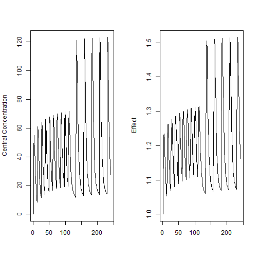
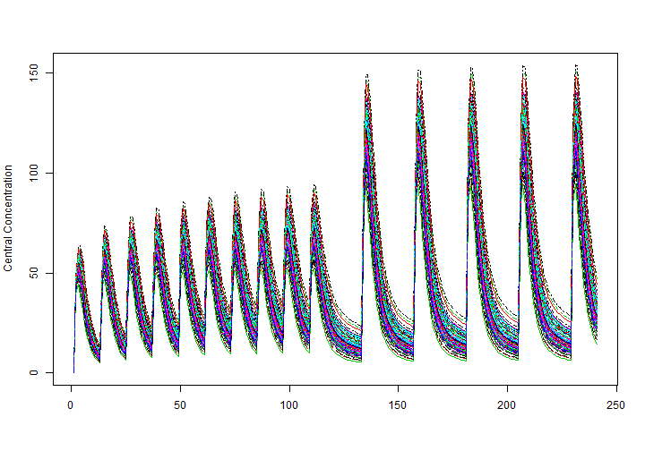
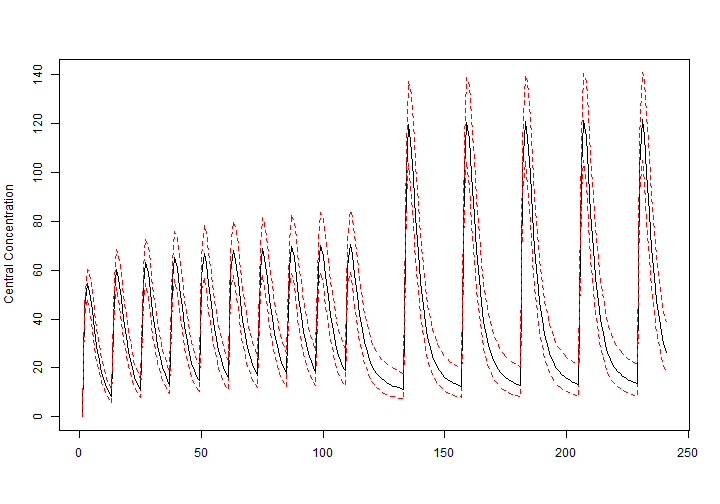

[](https://travis-ci.org/nlmixrdevelopment/RxODE)
[](https://ci.appveyor.com/project/mattfidler/rxode)
[](https://codecov.io/github/nlmixrdevelopment/RxODE?branch=master)
[](https://cran.r-project.org/package=RxODE)


## RxODE: A tool for performing simulations from Ordinary Differential Equation (ODE) models, with applications for pharmacometrics
***  

##### Authors: Melissa Hallow, Wenping Wang, and Matthew L. Fidler

***

`RxODE` installation under R for Windows
========================================

These notes briefly describe steps to properly install `RxODE` and to
ensure `Rtools` (https://cran.r-project.org/bin/windows/Rtools/) are properly 
configured to avoid compilation issues during the use of `RxODE`. 

In a nutshell, installing `RxODE` is very straight forwad, but installing
and configuring `Rtools` is a bit more delicate and you need to 
carefully follow the instructions in the "R Installation and Adminstration" 
manual, in particular Section 6.3, and Appendix D "The Windows Toolset". 
We point out a couple of details worth extra attention.  Please read on.

Steps:
------

1. Install the appropriate `Rtools` for your R for Windows version,
   e.g., `Rtools` 3.2 for R versions 3.1.x through 3.2.x (for full details
   see http://cran.r-project.org/bin/windows/Rtools/). A couple of 
   important details:

   * When installing `Rtools`, in the "Select Components" dialog box, 
     you may select the default "Package authoring installation".

   * In the "Select Additional Tasks" dialog window, check the
     option "Edit the system PATH".  This is important to be able to
     locate the C, Fortran compilers and other tools needed during 
     the use of `RxODE`.  

   * A simple way to test whether `Rtools` was properly installed is
     to compile the `hello.c` program.  Simply open a new MSDOS command 
     window, create a text file `hello.c` and compile it as follows:
   
     ```
     C:\hello> type hello.c
     #include<stdio.h>
     
     void main(int argc, char **argv)
     {
         printf("Hello World!\n");
     }

     C:\hello> gcc -o hello hello.c

     C:\hello> .\hello
     Hello World!
     ```

     If you get the error `gcc: error: CreateProcess: No such file or directory`     then you know `Rtools` was not properly installed, in particular,
     it did not update your system `PATH` variable.

2.  Obtain the `RxODE` package, either from github or CRAN.  The 
    installation requires use of the gcc compiler, so you'll know if Step 1 
    was successfully executed.

    * CRAN. Use the usual method for installing pacakges from CRAN.

    * GitHub. First install the `devtools` package (if needed) and 
      then `RxODE` from GitHub.  You may want to avoid using a library 
      folder that has spaces in its name (see question 4.1 in the 
      "R for Windows FAQ" and the pointers therein).  As of `RxODE`
      version 0.5-1, we've been able to test installations on folder with 
      spaces in their name, but you may want to be on the safe side.
      
      ``` 
      install.packages("devtools")
      library("devtools", lib = "C:/Rlib")
      install_github("hallowkm/RxODE/RxODE")
      ```

3. Test the `RxODE` installation:

    ``` 
    library("RxODE", lib = "C:/Rlib")
    demo("demo1","RxODE")
    ```

If the demo runs without error, click on the plot window and see if a 
new plot comes up each time. If so, `RxODE` has been installed correctly.

See `browseVignettes("RxODE")` for an extended example on using 
`RxODE` for simulations.

#### Introduction
`RxODE` is an R package that facilitates simulation with ODE models in
R. It is designed with pharmacometrics models in mind, but can be
applied more generally to any ODE model.

***
#### Description of RxODE illustrated through an example
The model equations are specified through a text string in R. Both
differential and algebraic equations are permitted. Differential
equations are specified by `d/dt(var_name) = `. Each
equation is separated by a semicolon.

```r
ode <- "
   C2 = centr/V2;
   C3 = peri/V3;
   d/dt(depot) =-KA*depot;
   d/dt(centr) = KA*depot - CL*C2 - Q*C2 + Q*C3;
   d/dt(peri)  =                    Q*C2 - Q*C3;
   d/dt(eff)  = Kin - Kout*(1-C2/(EC50+C2))*eff;
"
```
To load `RxODE` package and compile the model: 

```r
library(RxODE)
work <- tempfile("Rx_intro-")
mod1 <- RxODE(model = ode, modName = "mod1", wd = work)
```

A typical pharmacokinetics-pharmacodynamics (PKPD) model can be
plotted in `RxODE`. This model, as shown in the figure below:

```r
plot(mod1);
```

```
##                              C2                              C3 
##                      "centr/V2"                       "peri/V3" 
##                     d/dt(depot)                     d/dt(centr) 
##                     "-KA*depot"      "KA*depot-CL*C2-Q*C2+Q*C3" 
##                      d/dt(peri)                       d/dt(eff) 
##                     "Q*C2-Q*C3" "Kin-Kout*(1-C2/(EC50+C2))*eff"
```


Sometimes the size of the boxes may need to be adjusted, you can do
this by adjusting the `size` argument:

```r
plot(mod1,size=40);
```

```
##                              C2                              C3 
##                      "centr/V2"                       "peri/V3" 
##                     d/dt(depot)                     d/dt(centr) 
##                     "-KA*depot"      "KA*depot-CL*C2-Q*C2+Q*C3" 
##                      d/dt(peri)                       d/dt(eff) 
##                     "Q*C2-Q*C3" "Kin-Kout*(1-C2/(EC50+C2))*eff"
```


Model parameters can be defined as named vectors. Names of parameters in
the vector must be a superset of parameters in the ODE model, and the
order of parameters within the vector is not important. 

```r
theta <- 
   c(KA=2.94E-01, CL=1.86E+01, V2=4.02E+01, # central 
     Q=1.05E+01,  V3=2.97E+02,              # peripheral
     Kin=1, Kout=1, EC50=200)               # effects  
```

Initial conditions (ICs) are defined through a vector as well. If the
vector is not named, the number of ICs must equal exactly the number of
ODEs in the model, and the order must be the same as the order in
which the ODEs are listed in the model. 

```r
inits <- c(0, 0, 0, 1)    
```

When elements are named, missing elements are added and set to
zero. Also when named, the order of initilizations does not matter.
Therefore the following code is an equvalent initialization as the
code above.

```r
inits <- c(eff=1);
```


`RxODE` provides a simple and very flexible way to specify dosing and
sampling through functions that generate an event table. First, an
empty event table is generated through the "eventTable()" function:

```r
ev <- eventTable(amount.units='mg', time.units='hours')
```

Next, use the `add.dosing()` and `add.sampling()` functions of the
`EventTable` object to specify the dosing (amounts, frequency and/or
times, etc.) and observation times at which to sample the state of the
system.  These functions can be called multiple times to specify more
complex dosing or sampling regiments.  Here, these functions are used
to specify 10mg BID dosing for 5 days, followed by 20mg QD dosing for
5 days:

```r
ev$add.dosing(dose=10000, nbr.doses=10, dosing.interval=12)
ev$add.dosing(dose=20000, nbr.doses=5, start.time=120, dosing.interval=24)
ev$add.sampling(0:240)
```

If you wish you can also do this with the `mattigr` pipe operator `%>%`

```r
ev <- eventTable(amount.untis="mg", time.units="hours") %>%
    add.dosing(dose=10000, nbr.doses=10, dosing.interval=12) %>%
    add.dosing(dose=20000, nbr.doses=5, start.time=120,dosing.interval=24) %>%
    add.sampling(0:240);
```

```
## Error in eventTable(amount.untis = "mg", time.units = "hours"): unused argument (amount.untis = "mg")
```

The functions `get.dosing()` and `get.sampling()` can be used to
retrieve information from the event table.  

```r
head(ev$get.dosing())
```

```
##   time evid   amt
## 1    0  101 10000
## 2   12  101 10000
## 3   24  101 10000
## 4   36  101 10000
## 5   48  101 10000
## 6   60  101 10000
```

```r
head(ev$get.sampling())
```

```
##    time evid amt
## 16    0    0  NA
## 17    1    0  NA
## 18    2    0  NA
## 19    3    0  NA
## 20    4    0  NA
## 21    5    0  NA
```

The simulation can now be run by calling the model object's run
function. Simulation results for all variables in the model are stored
in the output matrix x. 

```r
x <- mod1$solve(theta, ev, inits)
```

```
## Warning in rxInits(object, inits, rxState(object), 0): Assiged depot,
## centr, peri to 0.
```

```r
head(x)
```

```
##      time     depot    centr      peri      eff       C2        C3
## [1,]    0 10000.000    0.000    0.0000 1.000000  0.00000 0.0000000
## [2,]    1  7452.765 1783.897  273.1895 1.084664 44.37555 0.9198298
## [3,]    2  5554.370 2206.295  793.8758 1.180825 54.88296 2.6729825
## [4,]    3  4139.542 2086.518 1323.5783 1.228914 51.90343 4.4564927
## [5,]    4  3085.103 1788.795 1776.2702 1.234610 44.49738 5.9807076
## [6,]    5  2299.255 1466.670 2131.7169 1.214742 36.48434 7.1774981
```

This returns a matrix.  You can see the compartment values in the plot
below:

```r
par(mfrow=c(1,2))
matplot(x[,"C2"], type="l", ylab="Central Concentration")
matplot(x[,"eff"], type="l", ylab = "Effect")
```



You can also return a solved object that
behaves a little like a data-frame.

This can also be solved by the `predict()` or `solve()` methods:

```r
x <- predict(mod1,theta, ev, inits)
```

```
## Warning in rxInits(object, inits, rxState(object), 0): Assiged depot,
## centr, peri to 0.
```

```r
print(x)
```

```
## Solved RxODE object
## Dll: C:\Users\fidlema3\AppData\Local\Temp\ep\RtmpC80kEF\Rx_intro-13e440de7946/mod1.d/mod1_i386.dll
## 
## Parameters:
##      V2      V3      KA      CL       Q     Kin    Kout    EC50 
##  40.200 297.000   0.294  18.600  10.500   1.000   1.000 200.000 
## 
## 
## Initial Conditions:
## depot centr  peri   eff 
##     0     0     0     1 
## 
## 
## First part of data:
## # A tibble: 241 × 7
##    time     depot    centr      peri      eff       C2        C3
##   <dbl>     <dbl>    <dbl>     <dbl>    <dbl>    <dbl>     <dbl>
## 1     0 10000.000    0.000    0.0000 1.000000  0.00000 0.0000000
## 2     1  7452.765 1783.897  273.1895 1.084664 44.37555 0.9198298
## 3     2  5554.370 2206.295  793.8758 1.180825 54.88296 2.6729825
## 4     3  4139.542 2086.518 1323.5783 1.228914 51.90343 4.4564927
## 5     4  3085.103 1788.795 1776.2702 1.234610 44.49738 5.9807076
## 6     5  2299.255 1466.670 2131.7169 1.214742 36.48434 7.1774981
## # ... with 235 more rows
```
or

```r
x <- solve(mod1,theta, ev, inits)
```

```
## Warning in rxInits(object, inits, rxState(object), 0): Assiged depot,
## centr, peri to 0.
```

```r
print(x)
```

```
## Solved RxODE object
## Dll: C:\Users\fidlema3\AppData\Local\Temp\ep\RtmpC80kEF\Rx_intro-13e440de7946/mod1.d/mod1_i386.dll
## 
## Parameters:
##      V2      V3      KA      CL       Q     Kin    Kout    EC50 
##  40.200 297.000   0.294  18.600  10.500   1.000   1.000 200.000 
## 
## 
## Initial Conditions:
## depot centr  peri   eff 
##     0     0     0     1 
## 
## 
## First part of data:
## # A tibble: 241 × 7
##    time     depot    centr      peri      eff       C2        C3
##   <dbl>     <dbl>    <dbl>     <dbl>    <dbl>    <dbl>     <dbl>
## 1     0 10000.000    0.000    0.0000 1.000000  0.00000 0.0000000
## 2     1  7452.765 1783.897  273.1895 1.084664 44.37555 0.9198298
## 3     2  5554.370 2206.295  793.8758 1.180825 54.88296 2.6729825
## 4     3  4139.542 2086.518 1323.5783 1.228914 51.90343 4.4564927
## 5     4  3085.103 1788.795 1776.2702 1.234610 44.49738 5.9807076
## 6     5  2299.255 1466.670 2131.7169 1.214742 36.48434 7.1774981
## # ... with 235 more rows
```

Or with `mattigr`

```r
x <- mod1 %>% solve(theta, ev, inits)
```

```
## Warning in rxInits(object, inits, rxState(object), 0): Assiged depot,
## centr, peri to 0.
```

```r
print(x)
```

```
## Solved RxODE object
## Dll: C:\Users\fidlema3\AppData\Local\Temp\ep\RtmpC80kEF\Rx_intro-13e440de7946/mod1.d/mod1_i386.dll
## 
## Parameters:
##      V2      V3      KA      CL       Q     Kin    Kout    EC50 
##  40.200 297.000   0.294  18.600  10.500   1.000   1.000 200.000 
## 
## 
## Initial Conditions:
## depot centr  peri   eff 
##     0     0     0     1 
## 
## 
## First part of data:
## # A tibble: 241 × 7
##    time     depot    centr      peri      eff       C2        C3
##   <dbl>     <dbl>    <dbl>     <dbl>    <dbl>    <dbl>     <dbl>
## 1     0 10000.000    0.000    0.0000 1.000000  0.00000 0.0000000
## 2     1  7452.765 1783.897  273.1895 1.084664 44.37555 0.9198298
## 3     2  5554.370 2206.295  793.8758 1.180825 54.88296 2.6729825
## 4     3  4139.542 2086.518 1323.5783 1.228914 51.90343 4.4564927
## 5     4  3085.103 1788.795 1776.2702 1.234610 44.49738 5.9807076
## 6     5  2299.255 1466.670 2131.7169 1.214742 36.48434 7.1774981
## # ... with 235 more rows
```

The solved object acts as a `data.frame` or `tbl` that can be filtered
by `dpylr`.  For example you could filter it easily.

```r
library(dplyr)
x <- mod1 %>% solve(theta,ev,inits) %>%  filter(time <=3)
```

```
## Warning in rxInits(object, inits, rxState(object), 0): Assiged depot,
## centr, peri to 0.
```

```r
x
```

```
##   time     depot    centr      peri      eff       C2        C3
## 1    0 10000.000    0.000    0.0000 1.000000  0.00000 0.0000000
## 2    1  7452.765 1783.897  273.1895 1.084664 44.37555 0.9198298
## 3    2  5554.370 2206.295  793.8758 1.180825 54.88296 2.6729825
## 4    3  4139.542 2086.518 1323.5783 1.228914 51.90343 4.4564927
```

It can also be transformed to a `data.table`:

```r
dt <- NULL
if (any(installed.packages()[,"Package"] == "data.table")){
    library(data.table)
    dt <- as.data.table(mod1 %>% solve(theta, ev, inits))
}
```

```
## Warning in rxInits(object, inits, rxState(object), 0): Assiged depot,
## centr, peri to 0.
```

```r
dt
```

```
##      time       depot     centr       peri      eff       C2         C3
##   1:    0 10000.00000    0.0000     0.0000 1.000000  0.00000  0.0000000
##   2:    1  7452.76491 1783.8970   273.1895 1.084664 44.37555  0.9198298
##   3:    2  5554.37049 2206.2948   793.8758 1.180825 54.88296  2.6729825
##   4:    3  4139.54175 2086.5177  1323.5783 1.228914 51.90343  4.4564927
##   5:    4  3085.10315 1788.7947  1776.2702 1.234610 44.49738  5.9807076
##  ---                                                                   
## 237:  236    55.94393  657.1472 12306.1449 1.085710 16.34694 41.4348314
## 238:  237    41.69367  634.5027 12044.3385 1.082312 15.78365 40.5533284
## 239:  238    31.07331  614.4486 11786.1638 1.079377 15.28479 39.6840532
## 240:  239    23.15820  596.3951 11532.0795 1.076794 14.83570 38.8285506
## 241:  240    17.25925  579.9010 11282.3975 1.074483 14.42540 37.9878702
```

However it isn't just a simple data object.  You can use the solved
object to update paramters on the fly, or even change the sampling
time.

```r
x <- mod1 %>% solve(theta,ev,inits);
```

```
## Warning in rxInits(object, inits, rxState(object), 0): Assiged depot,
## centr, peri to 0.
```

To examine or change initial conditions, you can use the syntax
`cmt.0`, `cmt0`, or `cmt_0`. In the case of the `eff` compartment
defined by the model, this is:

```r
x$eff0
```

```
## eff 
##   1
```

which shows the initial condition of the effect compartment.  If you
wished to change this initial condition to 2, this can be done easily
by:

```r
x$eff0 <- 2
```

```
## Updating object with new initial conditions.
```

```r
x
```

```
## Solved RxODE object
## Dll: C:\Users\fidlema3\AppData\Local\Temp\ep\RtmpC80kEF\Rx_intro-13e440de7946/mod1.d/mod1_i386.dll
## 
## Parameters:
##      V2      V3      KA      CL       Q     Kin    Kout    EC50 
##  40.200 297.000   0.294  18.600  10.500   1.000   1.000 200.000 
## 
## 
## Initial Conditions:
## depot centr  peri   eff 
##     0     0     0     2 
## 
## 
## First part of data:
## # A tibble: 241 × 7
##    time     depot    centr      peri      eff       C2        C3
##   <dbl>     <dbl>    <dbl>     <dbl>    <dbl>    <dbl>     <dbl>
## 1     0 10000.000    0.000    0.0000 2.000000  0.00000 0.0000000
## 2     1  7452.765 1783.897  273.1895 1.496778 44.37555 0.9198299
## 3     2  5554.370 2206.295  793.8759 1.366782 54.88295 2.6729829
## 4     3  4139.542 2086.517 1323.5786 1.313536 51.90341 4.4564937
## 5     4  3085.103 1788.793 1776.2706 1.272430 44.49735 5.9807092
## 6     5  2299.255 1466.669 2131.7173 1.231204 36.48431 7.1774995
## # ... with 235 more rows
```

Notice that the inital effect is now `2`.

You can also change the sampling times easily by this method by
changing `t` or `time`.  For example:

```r
x$t <- seq(0,5,length.out=20)
```

```
## Updating sampling times in the event table updating object.
```

```r
x
```

```
## Solved RxODE object
## Dll: C:\Users\fidlema3\AppData\Local\Temp\ep\RtmpC80kEF\Rx_intro-13e440de7946/mod1.d/mod1_i386.dll
## 
## Parameters:
##      V2      V3      KA      CL       Q     Kin    Kout    EC50 
##  40.200 297.000   0.294  18.600  10.500   1.000   1.000 200.000 
## 
## 
## Initial Conditions:
## depot centr  peri   eff 
##     0     0     0     2 
## 
## 
## First part of data:
## # A tibble: 20 × 7
##        time     depot     centr      peri      eff       C2        C3
##       <dbl>     <dbl>     <dbl>     <dbl>    <dbl>    <dbl>     <dbl>
## 1 0.0000000 10000.000    0.0000   0.00000 2.000000  0.00000 0.0000000
## 2 0.2631579  9255.488  677.1371  24.26134 1.787179 16.84421 0.0816880
## 3 0.5263158  8566.406 1186.8059  88.67937 1.646825 29.52253 0.2985837
## 4 0.7894737  7928.627 1562.0986 182.59671 1.551517 38.85817 0.6148038
## 5 1.0526316  7338.331 1830.0078 297.50288 1.485338 45.52258 1.0016932
## 6 1.3157895  6791.983 2012.5211 426.63581 1.438438 50.06271 1.4364842
## # ... with 14 more rows
```

You can also access or change parameters in this way:

```r
x$KA <- 1;
```

```
## Updating object with new paramter values.
```

```r
x
```

```
## Solved RxODE object
## Dll: C:\Users\fidlema3\AppData\Local\Temp\ep\RtmpC80kEF\Rx_intro-13e440de7946/mod1.d/mod1_i386.dll
## 
## Parameters:
##    V2    V3    KA    CL     Q   Kin  Kout  EC50 
##  40.2 297.0   1.0  18.6  10.5   1.0   1.0 200.0 
## 
## 
## Initial Conditions:
## depot centr  peri   eff 
##     0     0     0     2 
## 
## 
## First part of data:
## # A tibble: 241 × 7
##    time      depot     centr      peri      eff        C2        C3
##   <dbl>      <dbl>     <dbl>     <dbl>    <dbl>     <dbl>     <dbl>
## 1     0 10000.0000    0.0000    0.0000 2.000000   0.00000  0.000000
## 2     1  3678.7945 4245.2332  742.6034 1.669738 105.60282  2.500348
## 3     2  1353.3534 3650.5802 1767.4951 1.589641  90.81045  5.951162
## 4     3   497.8706 2398.6713 2479.2430 1.473088  59.66844  8.347619
## 5     4   183.1561 1442.4959 2876.7992 1.335833  35.88298  9.686193
## 6     5    67.3793  852.3637 3064.0837 1.217771  21.20308 10.316780
## # ... with 235 more rows
```


You can access/change all the parametrs, initilizations or events with
the `$params`, `$inits`, `$events` accessor syntax, similar to what is
used above.

This syntax makes it easy to update and explore the effect of various
parametrs on the solved object.

#### Simulation of Variability with RxODE
Variability in model parameters can be simulated by creating a matrix
of parameter values for use in the simulation. In the example below,
40% variability in clearance is simulated. 

```r
options(RxODE.warn.on.assign = FALSE); ## Turn of warning on assignment of initial conditions
nsub <- 100						  #number of subproblems
CL <- 1.86E+01*exp(rnorm(nsub,0,.4^2))
theta.all <- 
	cbind(KA=2.94E-01, CL=CL, V2=4.02E+01,  # central 
	Q=1.05E+01, V3=2.97E+02,                # peripheral
	Kin=1, Kout=1, EC50=200)                # effects  
head(theta.all)
```

```
##         KA       CL   V2    Q  V3 Kin Kout EC50
## [1,] 0.294 17.12182 40.2 10.5 297   1    1  200
## [2,] 0.294 16.19309 40.2 10.5 297   1    1  200
## [3,] 0.294 22.43899 40.2 10.5 297   1    1  200
## [4,] 0.294 18.35741 40.2 10.5 297   1    1  200
## [5,] 0.294 19.11127 40.2 10.5 297   1    1  200
## [6,] 0.294 22.24332 40.2 10.5 297   1    1  200
```

Each subproblem can be simulated by using an explicit loop (or the `apply()`
function) to run the simulation for each set of parameters of in the parameter
matrix. 

```r
nobs <- ev$get.nobs()
set.seed(1)
cp.all <- matrix(NA, nobs, nsub)
for (i in 1:nsub)
{
	theta <- theta.all[i,]
	x <- mod1$solve(theta, ev, inits=inits)
	cp.all[, i] <- x[, "C2"]
}

matplot(cp.all, type="l", ylab="Central Concentration")
```



It is now straightforward to perform calculations and generate plots
with the simulated data. Below,  the 5th, 50th, and 95th percentiles
of the simulated data are plotted. 

```r
cp.q <- apply(cp.all, 1, quantile, prob = c(0.05, 0.50, 0.95))
matplot(t(cp.q), type="l", lty=c(2,1,2), col=c(2,1,2), ylab="Central Concentration")
```



#### Facilities for generating R shiny applications

An example of creating an R [shiny application](http://shiny.rstudio.com) to
interactively explore responses of various complex dosing regimens is available
at http://qsp.engr.uga.edu:3838/RxODE/RegimenSimulator.  Shiny applications
like this one may be programmatically created with the experimental function
`genShinyApp.template()`.

The above application includes widgets for varying the dose, dosing
regimen, dose cycle, and number of cycles.

```

genShinyApp.template(appDir = "shinyExample", verbose=TRUE)

library(shiny)
runApp("shinyExample")

```

### [Click here to go to the Shiny App](http://qsp.engr.uga.edu:3838/RxODE/RegimenSimulator)

